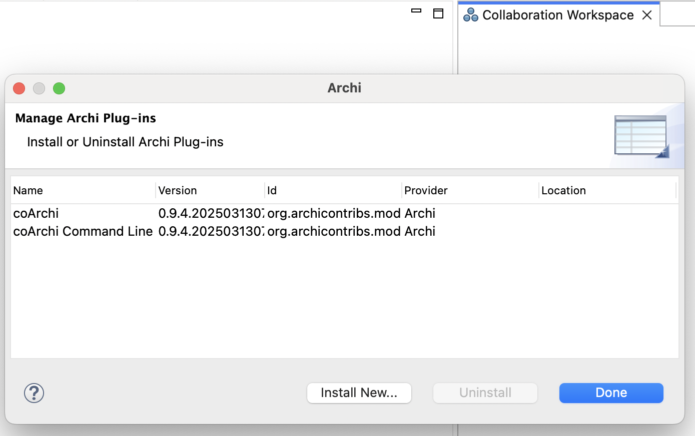
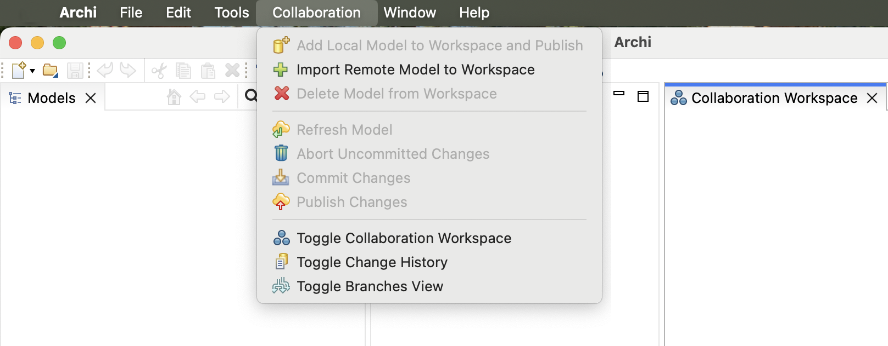
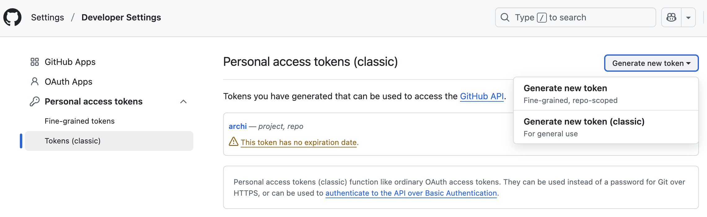
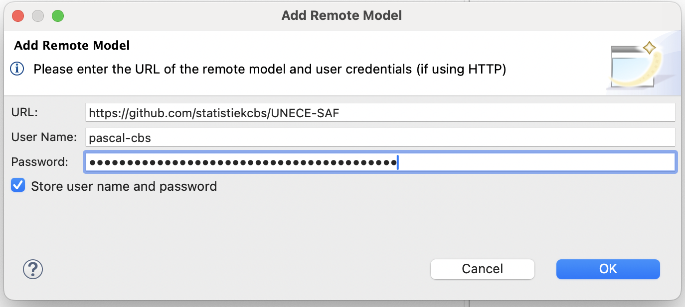
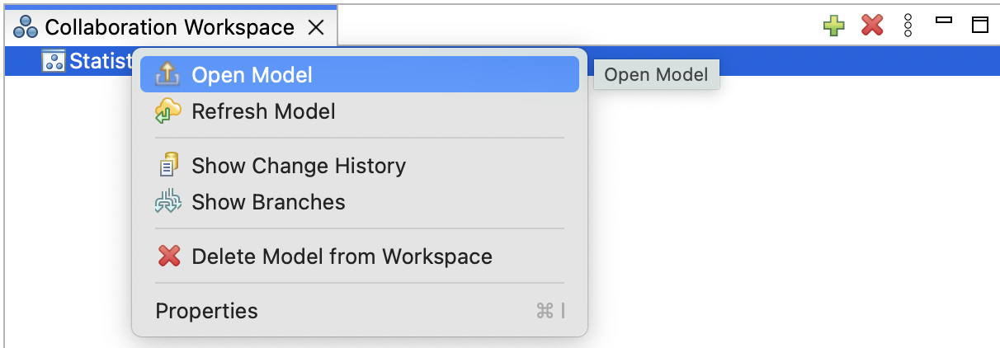
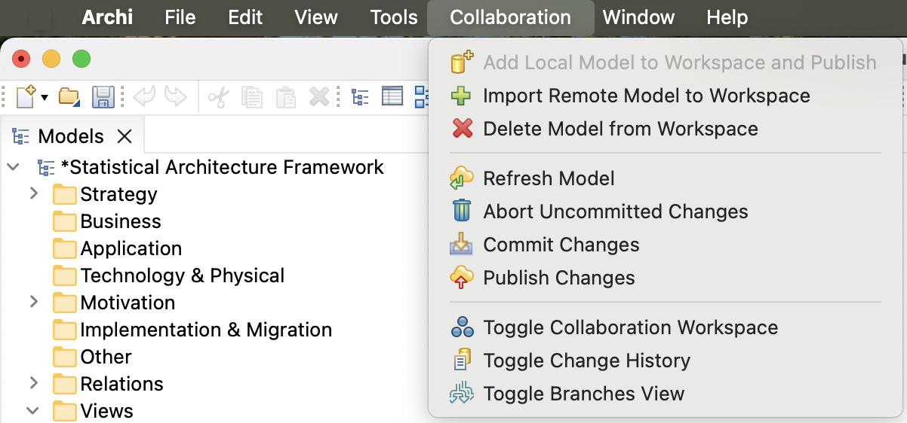
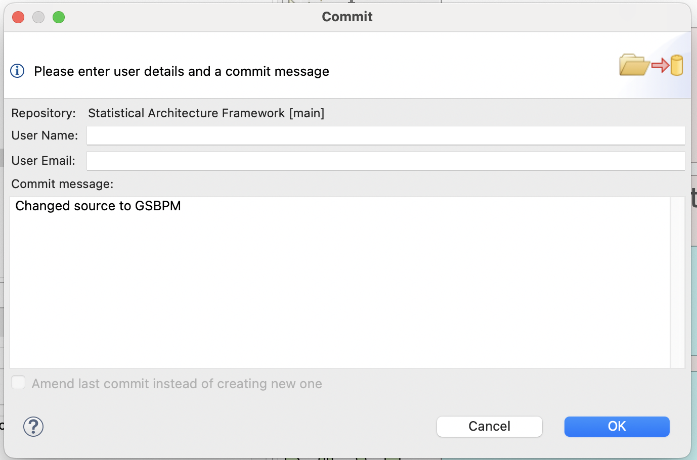
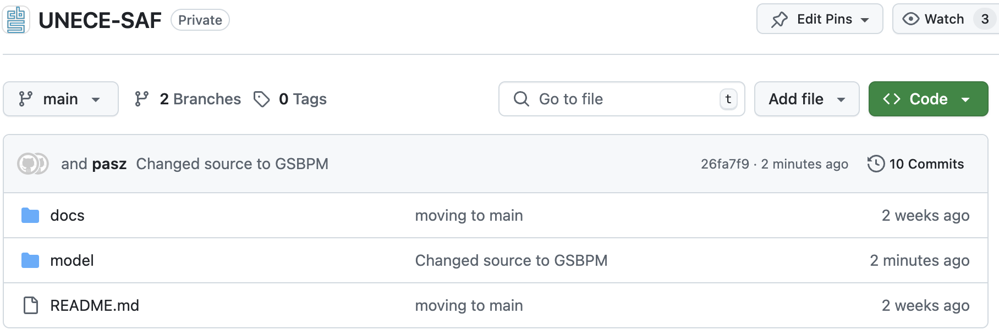

# Software
- Download and install Archi : https://www.archimatetool.com/download/
- Download coArchi from : https://www.archimatetool.com/plugins/
- Install the plugin : Help -> Manage plugins -> Install -> choose coArchi_0.9.4.archiplugin -> restart Archi.



## From the Collaboration menu : 
- Toggle Collaboration Workspace
- Import Remote Model to Workspace



- When no local password is set, set a password to protect your repository on the local machine
- A github token can be obtained here : https://github.com/settings/tokens. Create a classis token and save the token in a safe environment.



- The "Add Remote Model" popup is shown. 

	Choose :
	```
	URL : https://github.com/statistiekcbs/UNECE-SAF
	User Name : [your github user]
	Password : [Personal access token] 
	```
	Check the Store user name and password checkbox.



- The Statistical Architecture Framework [main] should be shown in the Collaboration Workspace part of Archi.
- Right click to open the model.




## Collaboration



You are now set up to collaborate. Changes to the Model can be published as follows:
- Save the Model (will be asked when necessary)
- Publish Changes
- A commit form will be shown. Give comment on what the commit is.



- Publish.
- Check the repository online if changes are available


